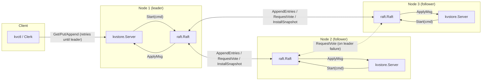

# raft-kv-store

A distributed key-value store built on the Raft consensus algorithm, written in Go.
Several nodes elect a leader, replicate a write-ahead log, survive node crashes,
and serve linearizable reads and writes. Includes a fault-injection test harness
(node crashes, network partitions, message delay/drop) modeled on the MIT 6.5840
(6.824) lab test suites, so correctness is demonstrated by passing tests rather
than asserted by hand.

## Why

Consensus is a classic distributed-systems interview topic and the mechanism
that keeps services like Azure's control planes (and etcd/Consul/CockroachDB
generally) consistent across node failures. This project implements it from
first principles: leader election, log replication, persistence, and a
replicated state machine (the KV store) on top.

## Architecture



Write path: a client calls a server (any server); if it isn't the leader it
replies `ErrWrongLeader` and the Clerk retries the next one. The leader
appends the command to its Raft log via `Start()`, replicates it to a
majority via `AppendEntries`, and only applies it to the `map[string]string`
once Raft reports it committed on `ApplyCh` — so a `Get` is linearizable
too, since it goes through the same log rather than reading local state
that could be stale after a partition. See [docs/DESIGN.md](docs/DESIGN.md)
for the full write/read path and [docs/TESTING.md](docs/TESTING.md) for how
leader crashes and partitions are exercised in tests.

## Documents

- [docs/DESIGN.md](docs/DESIGN.md) — architecture, Raft state machine, RPCs, KV layer, consistency model
- [docs/ROADMAP.md](docs/ROADMAP.md) — build phases, mapped to MIT 6.5840 labs (2A/2B/2C/2D/3A/3B)
- [docs/TESTING.md](docs/TESTING.md) — fault-injection harness design and how to run it
- [CONTRIBUTING.md](CONTRIBUTING.md) — how to run tests, ground rules for changes to `raft/`/`kvstore/`

## Layout

```
raft/          Raft consensus core (election, log replication, persistence)
kvstore/       Replicated key-value service built on top of raft.Raft
transport/     RPC transport: in-memory (testable, fault-injectable) + real TCP
cmd/kvserver/  Standalone server binary (real cluster deployment)
cmd/kvctl/     CLI client for Get/Put/Append against a cluster
test/          End-to-end fault-injection scenarios
```

## Status

See [docs/ROADMAP.md](docs/ROADMAP.md) for current phase.

## Running tests

```bash
go test ./raft/...      # unit + fault-injection tests for consensus
go test ./kvstore/...   # KV linearizability + fault-injection tests
go test ./...           # everything
```

## Running a real cluster

```bash
go build -o bin/kvserver ./cmd/kvserver
./bin/kvserver -id 1 -peers "1=localhost:9001,2=localhost:9002,3=localhost:9003" -data data/1 &
./bin/kvserver -id 2 -peers "1=localhost:9001,2=localhost:9002,3=localhost:9003" -data data/2 &
./bin/kvserver -id 3 -peers "1=localhost:9001,2=localhost:9002,3=localhost:9003" -data data/3 &

go run ./cmd/kvctl -peers "localhost:9001,localhost:9002,localhost:9003" put foo bar
go run ./cmd/kvctl -peers "localhost:9001,localhost:9002,localhost:9003" get foo
```

By default `kvserver` logs leader/term changes and per-entry commit latency
(`-verbose=false` to silence it):

```
[raft 2] elected leader for term 1 (last log index 0)
[raft 2] committed index 1 (term 1) after 2.1ms
[raft 2] stepping down from leader, new term 3
```
