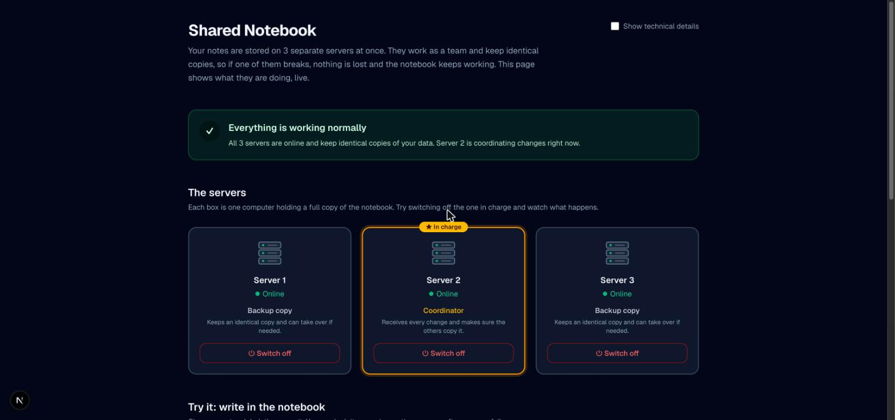
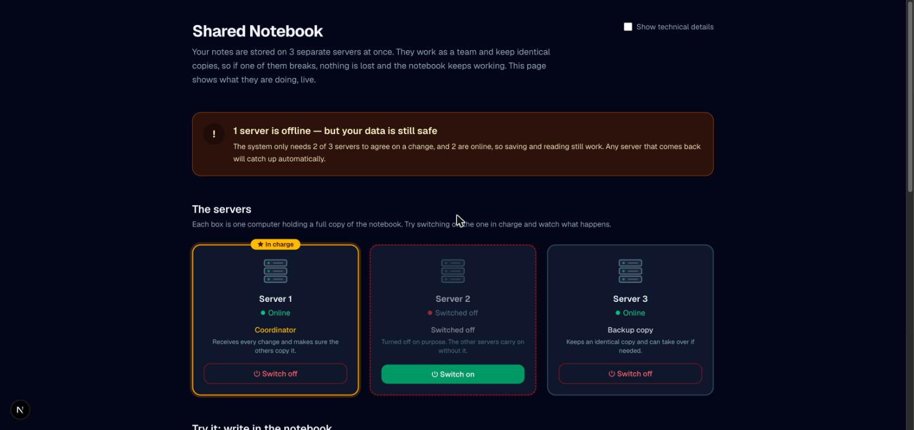
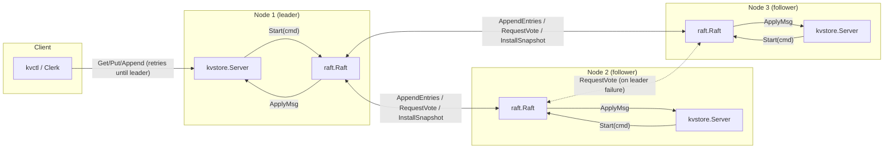

# Raft Key Value Store

A distributed key value store built on the Raft consensus algorithm, written in Go,
with a live web dashboard that explains what the cluster is doing in plain language.

Several servers elect a leader, replicate a write ahead log, survive server crashes,
and serve consistent reads and writes. A fault injection test suite (server crashes,
network partitions, dropped and delayed messages), modeled on the MIT 6.5840 lab
tests, shows that the system behaves correctly under failure.



## Table of Contents

- [Overview](#overview)
- [Features](#features)
- [How It Works](#how-it-works)
- [Architecture](#architecture)
- [Tech Stack](#tech-stack)
- [Project Structure](#project-structure)
- [Getting Started](#getting-started)
- [Using the Dashboard](#using-the-dashboard)
- [Command Line Client](#command-line-client)
- [Server Options](#server-options)
- [HTTP API](#http-api)
- [Testing](#testing)
- [Guarantees and Limitations](#guarantees-and-limitations)
- [Documentation](#documentation)
- [Contributing](#contributing)

## Overview

Databases such as etcd, Consul and CockroachDB keep several copies of their data on
different machines so that one failing machine does not take the service down or lose
data. The hard part is making every copy agree on the same sequence of changes, even
when machines crash or the network splits. Raft is a well known algorithm for solving
exactly that problem.

This project implements Raft from first principles: leader election, log replication,
persistence to disk, log compaction with snapshots, and a replicated key value store
on top. It runs as real processes talking over TCP, and comes with a dashboard that
lets anyone watch a failover happen and trigger one with a button.

## Features

| Area | What is included |
| --- | --- |
| Consensus | Leader election with randomized timeouts, log replication, commit tracking |
| Durability | Raft state and snapshots persisted to disk, recovered on restart |
| Log compaction | Snapshots and InstallSnapshot so a lagging server can catch up quickly |
| Key value service | Put, Append and Get, with exactly once handling of client retries |
| Consistency | Reads and writes both go through the Raft log, so reads are never stale |
| Networking | In memory transport for tests and a TCP transport for real clusters |
| Fault injection | Crashes, restarts, partitions, message loss and delay in tests |
| Chaos testing | Randomized test that crashes and restarts servers under live client load |
| Dashboard | Plain language live view of the cluster, notebook style data entry, event log |
| Demo controls | Optional buttons to switch servers off and on from the dashboard |
| Observability | Logs for leader changes, term changes and per entry commit latency |

## How It Works

The dashboard describes the system in everyday terms. The same three rules apply
underneath.

1. **One server is in charge.** The servers elect a leader. Every change goes through
   the leader, so there is a single agreed order of changes.
2. **Changes need a majority.** The leader copies each change to the other servers and
   only reports success once a majority (2 of 3, or 3 of 5) has stored it.
3. **If the leader fails, the rest carry on.** The remaining servers notice the silence,
   hold an election, and choose a new leader. Every confirmed change was already on a
   majority, so the new leader has it and nothing is lost.

If too many servers are down to form a majority, the cluster stops accepting changes
instead of risking two groups of servers disagreeing. It resumes on its own once
enough servers return.



## Architecture



Write path: a client can contact any server. A server that is not the leader replies
with `ErrWrongLeader` and the client tries the next one. The leader appends the command
to its log with `Start()`, replicates it to a majority with `AppendEntries`, and applies
it to the key value map only after Raft reports it committed. Get requests travel
through the same log, which is what makes reads linearizable. See
[docs/DESIGN.md](docs/DESIGN.md) for the full read and write paths.

## Tech Stack

| Layer | Technology |
| --- | --- |
| Consensus and storage | Go (standard library only) |
| Server to server RPC | Go `net/rpc` over TCP |
| Dashboard | Next.js 16, React 19, TypeScript |
| Styling | Tailwind CSS 4 |
| Testing | Go testing package with the race detector |

## Project Structure

| Path | Purpose |
| --- | --- |
| `raft/` | Raft consensus core: election, replication, persistence, snapshots |
| `kvstore/` | Replicated key value service and client (Clerk) built on `raft.Raft` |
| `transport/` | RPC transports: fault injectable in memory network and real TCP |
| `cmd/kvserver/` | Server binary, dashboard JSON API, demo power controls |
| `cmd/kvctl/` | Command line client for Get, Put and Append |
| `test/` | End to end fault injection and chaos scenarios |
| `web/` | Next.js dashboard |
| `docs/` | Design notes, roadmap, testing guide, screenshots |

## Getting Started

### Prerequisites

| Tool | Version |
| --- | --- |
| Go | 1.27 or newer |
| Node.js | 20 or newer, with npm |

### 1. Clone the repository

```bash
git clone https://github.com/Tech-Shadow21/raft-key-value-store.git
cd raft-key-value-store
```

### 2. Build and start a three server cluster

```bash
go build -o bin/kvserver ./cmd/kvserver

PEERS="1=localhost:9001,2=localhost:9002,3=localhost:9003"
./bin/kvserver -id 1 -peers "$PEERS" -data data/1 -http localhost:8001 -demo-controls &
./bin/kvserver -id 2 -peers "$PEERS" -data data/2 -http localhost:8002 -demo-controls &
./bin/kvserver -id 3 -peers "$PEERS" -data data/3 -http localhost:8003 -demo-controls &
```

Within a second one server logs that it was elected leader:

```
[raft 2] elected leader for term 1 (last log index 0)
```

### 3. Start the dashboard

```bash
cd web
cp .env.local.example .env.local
npm install
npm run dev
```

Open http://localhost:3000 in a browser.

`NEXT_PUBLIC_KV_NODES` in `web/.env.local` maps each server id to its `-http` address.
Edit it if you used different ports. The browser talks to these addresses directly,
so they must be reachable from wherever the dashboard is opened.

### 4. Stop everything

Press Ctrl+C in the dashboard terminal, then stop the servers:

```bash
pkill -f bin/kvserver
```

Data lives in `data/1`, `data/2` and `data/3`. Delete those folders to start fresh.

## Using the Dashboard

The dashboard is written for people who have never heard of Raft.

| Section | What it shows |
| --- | --- |
| Status banner | One sentence on overall health: normal, a server offline, choosing a coordinator, or paused |
| The servers | One card per server, showing online or offline and its role (coordinator or backup copy) |
| Notebook | Save, add to, or look up a note by label. Results explain how many servers confirmed the change |
| What is happening | A plain language log of events, such as a server stopping and a new coordinator taking over |
| How it works | The three rules above, in short form |
| Technical details | Optional toggle that adds Raft roles, terms, addresses and a glossary of terms |

A suggested demo:

1. Save a note, for example label `shopping-list` with note `milk, eggs, bread`.
2. Press **Switch off** on the server marked **In charge**.
3. Watch the banner turn amber and another server take over within about a second.
4. Look up `shopping-list` again. The note is still there.
5. Switch off a second server. The banner explains that changes are paused until a
   majority is back.
6. Switch both servers on again. They rejoin and catch up automatically.

## Command Line Client

```bash
go run ./cmd/kvctl -peers "localhost:9001,localhost:9002,localhost:9003" put foo bar
go run ./cmd/kvctl -peers "localhost:9001,localhost:9002,localhost:9003" append foo baz
go run ./cmd/kvctl -peers "localhost:9001,localhost:9002,localhost:9003" get foo
```

## Server Options

| Flag | Default | Description |
| --- | --- | --- |
| `-id` | required | This server's id. Must appear in `-peers` |
| `-peers` | required | Comma separated `id=host:port` list of every server's Raft address |
| `-data` | required | Directory for persisted Raft state and snapshots |
| `-http` | off | Address for the dashboard JSON API, for example `localhost:8001` |
| `-demo-controls` | `false` | Lets the dashboard switch this server off and on. Unauthenticated, use for demos only |
| `-max-raft-state` | `-1` | Take a snapshot once persisted Raft state exceeds this many bytes. `-1` disables |
| `-verbose` | `true` | Log leader changes, term changes and commit latency |

## HTTP API

Served on the `-http` address. All responses are JSON and allow cross origin requests
so the dashboard can call them from the browser.

| Method | Path | Body or query | Description |
| --- | --- | --- | --- |
| GET | `/api/status` | none | Server id, current term, whether it is leader, peers, power state |
| GET | `/api/kv` | `?key=name` | Read a key through the Raft log |
| POST | `/api/kv` | `{"key", "value", "op"}` where op is `put` or `append` | Write a key through the Raft log |
| POST | `/api/power` | `{"on": true}` or `{"on": false}` | Switch the server on or off. Requires `-demo-controls` |

Switching a server off simulates a crash inside the running process: its Raft instance
is stopped, every RPC to it is refused, and switching it on rebuilds it purely from
what was persisted to disk. This is the same crash and restart the test suite performs.

## Testing

```bash
go test ./...                                  # everything
go test ./raft/... -v                          # consensus unit and fault injection tests
go test ./kvstore/... -v                       # key value correctness under faults
go test ./test/... -run Chaos -v -count=5      # chaos test, several random seeds
go test ./... -race                            # run before every change
```

The tests run real Raft instances over an in memory network that the test controls.
They crash and restart servers, split the network into partitions, drop and delay
messages, and then check what was committed. They never mock Raft's own logic.
Highlights:

| Scenario | What is checked |
| --- | --- |
| Leader crash | A new leader is elected and no committed write is lost |
| No majority | No leader can be elected and no write is committed |
| Partitions | The minority side cannot commit, the majority side continues |
| Unreliable network | Agreement still holds with dropped and delayed messages |
| Restart from disk | A restarted server recovers its state and catches up |
| Snapshots | A lagging server catches up through InstallSnapshot |
| Chaos | Concurrent clients against five servers with random crashes, no write ever disappears |

See [docs/TESTING.md](docs/TESTING.md) for how the harness works.

## Guarantees and Limitations

Guaranteed while a majority of servers is up and can reach each other:

- Every confirmed write survives the crash of any minority of servers.
- Reads always return the latest confirmed value.
- A client retry never applies the same change twice.

Not covered, by design:

- Adding or removing servers while the cluster is running (membership changes).
- Malicious or arbitrarily faulty servers (Byzantine faults).
- Sharding data across multiple Raft groups.
- Authentication on the HTTP API. Keep it on a trusted network.

## Documentation

| Document | Contents |
| --- | --- |
| [docs/DESIGN.md](docs/DESIGN.md) | Architecture, Raft state machine, RPCs, key value layer, consistency model |
| [docs/TESTING.md](docs/TESTING.md) | Fault injection harness design and how to run it |
| [docs/ROADMAP.md](docs/ROADMAP.md) | Build phases, mapped to MIT 6.5840 labs |
| [CONTRIBUTING.md](CONTRIBUTING.md) | How to run tests and ground rules for changes to `raft/` and `kvstore/` |

## Contributing

Issues and pull requests are welcome. Please read [CONTRIBUTING.md](CONTRIBUTING.md)
first. Changes to `raft/` or `kvstore/` must keep `go test ./raft/... -race -count=10`
passing, since consensus bugs often depend on timing and will not show up in a single
run.
